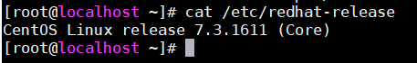
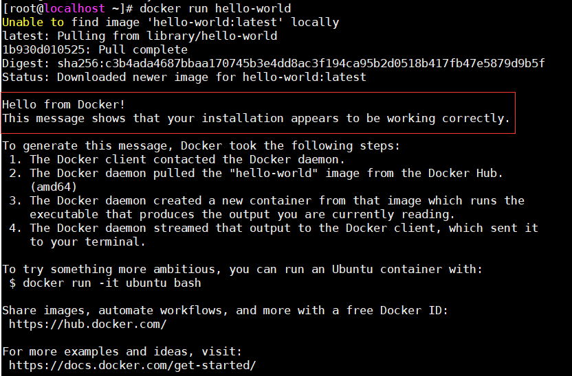
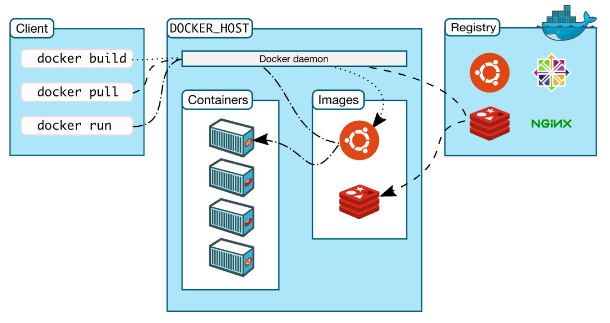

# Docker安装

#### 官方安装指南：<br>[https://docs.docker.com/install/linux/docker-ce/centos/#prerequisites](https://docs.docker.com/install/linux/docker-ce/centos/#prerequisites)

1. **查看linux系统版本，本文以CentOS为例** <br>
     <br>

2. **卸载旧版本** <br>
    ```
    $ sudo yum remove docker \
                    docker-client \
                    docker-client-latest \
                    docker-common \
                    docker-latest \
                    docker-latest-logrotate \
                    docker-logrotate \
                    docker-engine
    ```
    <br>
3. **设置repository** <br>
   1) 安装所需的软件包<br>
      ```
      $ sudo yum install -y yum-utils \
        device-mapper-persistent-data \
        lvm2
      ```
   2) 设置存储库  <br>
      ```
      $ sudo yum-config-manager \
        --add-repo \
        https://download.docker.com/linux/centos/docker-ce.repo
      ```

4. **安装DOCKER ENGINE - COMMUNITY**
   ```
   $ sudo yum install docker-ce docker-ce-cli containerd.io
   ```
5. **启动Docker**
   ```
   $ sudo systemctl start docker
   ```
6. **通过运行hello-world 镜像来验证是否正确安装了Docker Engine-Community**
   ```
   $ sudo docker run hello-world
   ```   
    <br>
   以下是Docker 架构图：<br>
    <br>

   容器由镜像生成，当执行docker run命令时，首先查看本地有没有hello-world镜像，没有则从仓库中拉取对应镜像并创建容器。<br>