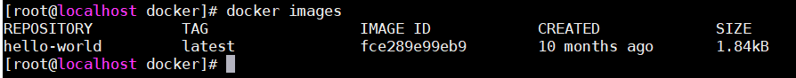
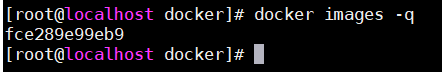
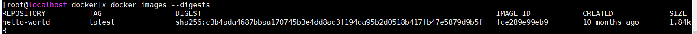
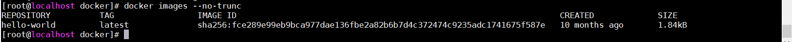
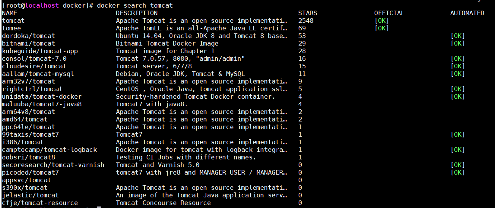
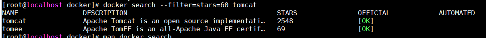
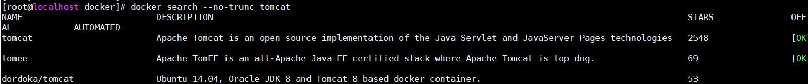
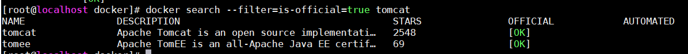
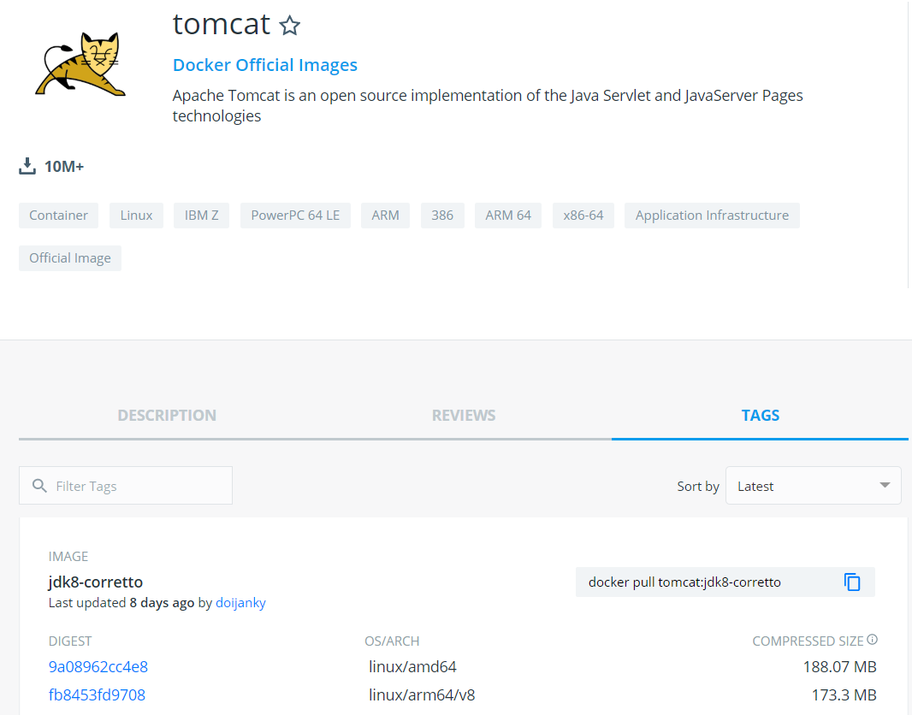
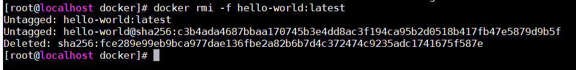

# Docker镜像

### 1. 什么是Docker镜像
可以简单理解为是启动容器的构建基石

### 2. 列出本地Docker镜像
docker images  

  
标题	| 解释
:--|:--
REPOSITORY | 镜像仓库源
TAG | 镜像标签（同一镜像多个标签即代表不同版本）
IMAGE ID | 镜像id
CREATED | 镜像创建时间
SIZE | 镜像大小
参数： 
- docker images -a 列出本地所有镜像，包含中间层镜像(一个镜像中间可能包含其他镜像) 
  -a, --all[=false]
      Show all images (default hides intermediate images) 
- docker images -q 只显示镜像id  
  -q, --quiet[=false]
  Only show numeric IDs  
  
- docker images --digests 显示镜像摘要信息  
  --digests[=false] Show digests  
    
- docker images --no-trunc 不截取显示 image id  
  --no-trunc[=false] Don't truncate output  
      

### 3. 查找镜像
使用 docker search 命令可以查找所有 Docker Hub 上公共的可用镜像，如： 
docker search tomcat  
  
标题	| 解释
:--|:--
NAME | 镜像名
DESCRIPTION | 描述
STARS | 用户受欢迎程度
OFFICIAL | 是否是官方镜像
AUTOMATED | 是否自动构建（表示这个镜像是由 Docker Hub 的自动构建流程创建的）
参数： 
- docker search --filter=stars=60 tomcat  
  查找stars数量大于或等于60的tomcat镜像  
    

- docker search --no-trunc tomcat  
  不省略输出  
    

- docker search --filter=is-official=true tomcat  
  只列出官方镜像  
    

- 更多可使用帮助命令： man docker search     
  
### 4. 拉取镜像
通过 docker pull 命令可以拉取Docker Hub/所配置的远程仓库镜像,但类似 docker pull tomcat（等价于 docker pull tomcat:latest） 的命令只会拉取最新的镜像，如果想要拉取对应tag的镜像可在Docker Hub上搜索后找到对应标签后再拉取。 
  

### 5. 删除镜像
docker rmi    
  