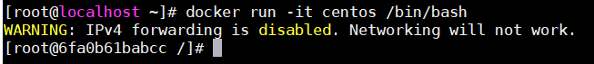
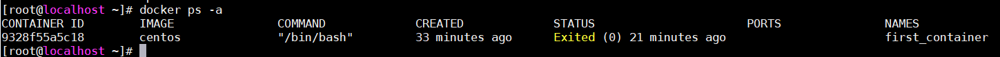

# Docker容器

### 1. 什么是Docker容器
Docker 可以帮助用户构建和部署容器，用户只需要把自己的应用程序或服务打包放进容器即可，容器是基于镜像启动起来的，容器中可以运行一个或多个进程。可以认为，镜像是Docker生命周期中的构建或打包阶段，而容器则是启动或执行阶段。

### 2. 运行Docker容器
可以使用命令 man docker run 查看run命令帮助文档  
使用 **docker run -it centos /bin/bash** 创建一个容器  
  
- -i 使我们能与容器进行shell交互
- -t 告诉docker为创建的容器分配一个伪tty终端
- /bin/bash 告诉docker执行此命令启动Bash shell  

如上报错可用以下方法解决：[https://blog.csdn.net/yjk13703623757/article/details/68939183](https://blog.csdn.net/yjk13703623757/article/details/68939183)

### 3. 退出容器
用户可以在容器中做任何自己想做的事情，当工作结束之后可通过  exit 命令退回到宿主机（容器停止运行） 
  
也可以使用ctrl+p ctrl+q，退回到宿主机并且容器不会停止运行。

### 4. 列出 Docker 容器
docker ps  (列出正在运行的容器)  
docker ps -a (列出所有容器，包含运行和停止的容器)  
  
docker ps -l (列出上一次运行的容器)  
属性	| 解释
:--|:--
CONTAINER ID | 容器id
IMAGE | 用于创建该容器的镜像
COMMAND | 容器最后执行的命令
CREATED | 创建时间
STATUS | 容器的退出状态
PORTS | 容器对外的端口号
NAMES | 容器名称，该名称默认由Docker自动生成

### 5. 容器重命名
docker rename angry_napier first_container   
以上命令可以将名称为angry_napier的容器重新命名为first_container 
也可以在创建容器的时候直接给容器命名： 
docker run --name first_container centos 
如果名称重复会报如下错误:  
  

### 6. 重新启动容器
  
如上图 first_container 容器已经停止，可以用以下命令重启。 
**docker start first_container**    

同样可以用这个命令: 
**docker restart first_container** 

### 7. 附着到容器上
以上虽然重新启动了容器，但是并没有进入交换式会话，可以使用如下命令重新附着到该容器的会话上： 
**docker attach first_container**

### 8.停止容器
**docker stop first_container**  
强制停止：**docker kill first_container**  

### 9. 删除容器
**docker rm first_container**