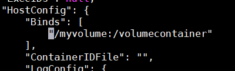
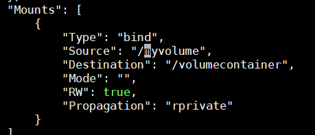
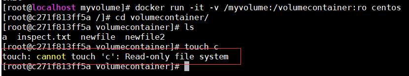
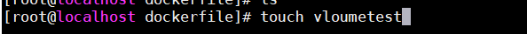
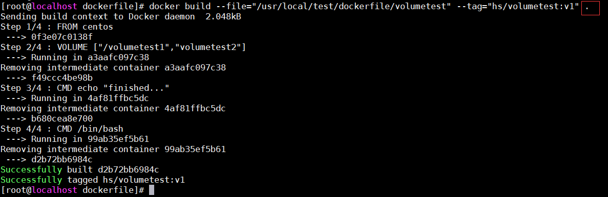
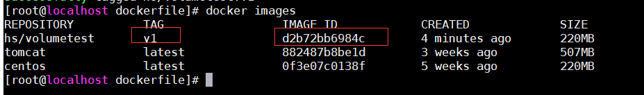
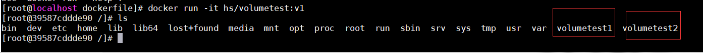
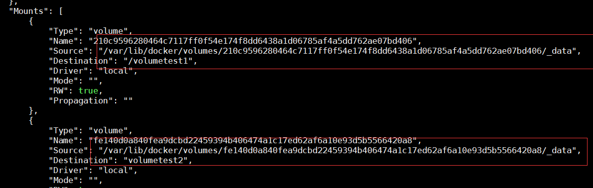

# Docker容器数据卷

### 1. 什么是Docker容器数据卷
docker的理念将运行的环境打包形成容器运行，运行可以伴随容器，但是我们对数据的要求是希望持久化，容器之间可以共享数据，Docker容器产生的数据，如果不通过docker commit生成新的镜像，使得数据作为容器的一部分保存下来，那么当容器被删除之后，数据也就没了，为了能够保存数据，在docker容器中使用卷。卷就是目录或者文件，存在于一个或者多个容器中，但是不属于联合文件系统，因此能够绕过Union File System提供一些用于持久化数据或共享数据的特点。<br>
参考：<br>
[https://www.jianshu.com/p/9c45a6d4496a](https://www.jianshu.com/p/9c45a6d4496a)

### 2. 作用
卷的设计目的就是数据的持久化，完全独立与容器的生命周期，因此Docker不会在容器删除时删除其挂载的数据卷。<br>
特点：<br>
   1. 数据卷可以在容器之间共享和重用数据。          <br>
   2. 卷的更改可以直接生效。                       <br>
   3. 数据卷的更改不会包含在镜像的更新中。          <br>
   4. 数据卷的生命周期一直持续到没有容器使用它为止。 <br>

### 3. 添加容器数据卷
有以下两种方式添加容器数据卷：<br>
1. 直接命令添加 
2. Dockerfile方式添加

### 4. 直接命令添加容器数据卷
**docker run -it -v /宿主机绝对路径:/容器绝对路径 镜像名** <br>
docker run -it -v /myvolume:/volumecontainer centos <br>
以上命令会自动在宿主机中创建/myvolume目录，在容器中创建volumecontainer目录。并且可以测试在宿主机中对应目录和在容器中对应目录创建文件，对方目录都可以共享。<br>
通过 **docker inspect e8b309ec533f** 命令可以看到多了如下数据：<br>
 <br>
 <br>
通过:ro 参数可以让容器内目录只可读<br>


### 5. Dockerfile方式添加容器数据卷
1. 创建dockerfile文件<br>
 <br>
内容如下：<br>
    ```
    #指定镜像继承自centos
    FROM centos
    #使用VOLUME命令给镜像添加两个数据卷
    VOLUME ["/volumetest1","volumetest2"]
    CMD echo "finished..."
    CMD /bin/bash
    ```
2. build生成镜像<br>
**docker build --file="/usr/local/test/dockerfile/volumetest" --tag="hs/volumetest:v1" .(后面必须加点)**
 <br>
查看新构建的镜像<br>
 <br>

3. 运行容器 <br>
**docker run -it hs/volumetest:v1** <br>
可以看到容器内已经有了两个容器卷：<br>
 <br>
通过**docker inspect 39587cddde90**命令可以看到"Mounts"配置下宿主机数据卷目录:<br>
