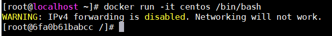

# Dockerfile

### 1. 什么是Dockerfile
Dockerfile是用来构建Docker镜像的构建文件，是由一系列命令和参数构成的脚本。

### 2. 运行Docker容器
可以使用命令 man docker run 查看run命令帮助文档  
使用 **docker run -it centos /bin/bash** 创建一个容器  
  
- -i 使我们能与容器进行shell交互
- -t 告诉docker为创建的容器分配一个伪tty终端
- /bin/bash 告诉docker执行此命令启动Bash shell  

如上报错可用以下方法解决：[https://blog.csdn.net/yjk13703623757/article/details/68939183](https://blog.csdn.net/yjk13703623757/article/details/68939183)
