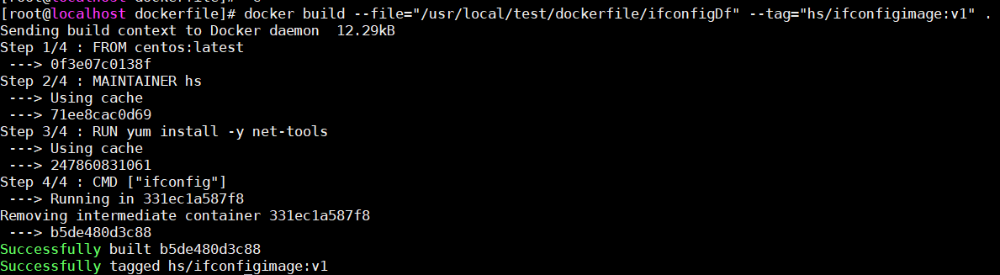
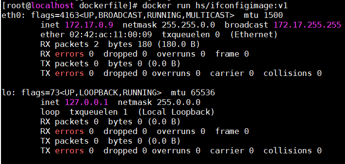
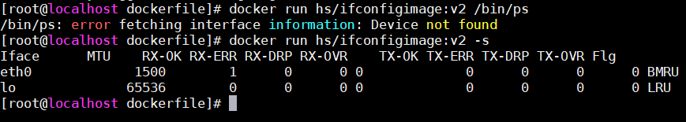

# Dockerfile

### 1. 什么是Dockerfile
Dockerfile是用来构建Docker镜像的构建文件，是由一系列命令和参数构成的脚本。

### 2. 构建第一个Dockerfile
1. 创建dockerfile文件 

   vi ifconfigDf
   代码如下：<br>   
   ```
   #继承自最新的centos镜像
   FROM centos:latest
   #指定维护者
   MAINTAINER hs
   #安装网络工具
   RUN yum install -y net-tools 
   #执行ifconfig命令
   CMD ["ifconfig"]
   ```
   **CMD指令**：有点类似RUN指令，但是RUN指令是指定镜像被构建时要运行的命令，而CMD是指定容器被启动时要运行的命令，以上还可以给指令传递参数，比如：<br>
   **CMD ["ifconfig","-a"]**
2. 构建镜像 <br>
   **docker build --file="/usr/local/test/dockerfile/ifconfigDf" --tag="hs/ifconfigimage:v1" .** <br>

    <br>
   如上：<br>
   Dockerfile由一系列指令和参数组成，每条指令，如FROM，都必须为大写字母，且后面要跟随一个参数，Dockerfile中的指令会按顺序从上而下执行，所以应该根据需要合理安排指令顺序。<br>
   每条指令都会创建一个新的镜像层并对镜像进行提交。Docker大体上按照如下流程执行Dockerfile中的指令：<br>
   - Docker从基础镜像运行一个容器
   - 执行一条指令，对容器做出修改
   - 执行类似docker commit的操作，提交一个新的镜像层
   - Docker再基于刚提交的镜像运行一个新的容器
   - 执行Dockerfile中的下一条指令，直到所有指令都执行完毕

3. 运行容器<br>
   **docker run hs/ifconfigimage:v1** <br>   
    <br>
   以上列出了网络端口信息。<br>

4. 覆盖Dockerfile文件中的CMD指令 <br>
   只需在镜像名后加对应命令即可:<br>
   **docker run hs/ifconfigimage:v1 /bin/ps** <br>

5. ENTRYPOINT指令 <br>
   ENTRYPOINT指令和CMD指令类似，但是使用ENTRYPOINT指令时，docker run 命令行中指定的任何参数都会被当做参数再次传递给ENTRYPOINT指令中指定的命令。<br>
   使用ENTRYPOINT方式改写以上Dockerfile: <br>
   ```
    #继承自最新的centos镜像
    FROM centos:latest
    #指定维护者
    MAINTAINER hs
    #安装网络工具
    RUN yum install -y net-tools
    #执行ifconfig命令
    ENTRYPOINT ["ifconfig"]
   ```
   再次bulid : <br>
   **docker build --file="/usr/local/test/dockerfile/ifconfigDf2" --tag="hs/ifconfigimage:v2" .** <br>
   运行容器:<br>
   可以看到，使用 docker run hs/ifconfigimage:v2 /bin/ps 命令报错，而docker run hs/ifconfigimage:v2 -s 命令则在ifconfig命令基础上添加了 -s 参数: <br>
   


