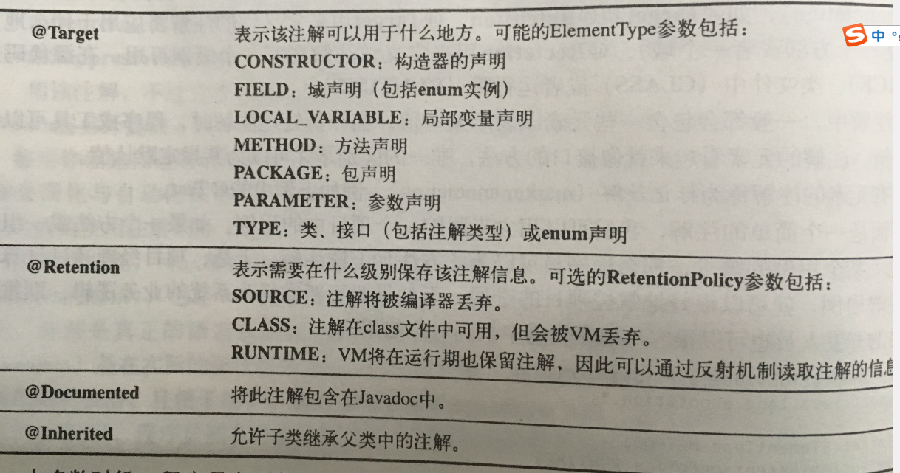

# 解释
注解（也被称为元数据）为我们在代码中添加信息提供了一种形式化的方法，使我们可以在稍后的某个时刻非常方便地使用这些数据。<br>
注解是众多引入到Java SE5中重要的语言变化之一。 <br>
注解的语法比较简单，除了@符号的使用之外，它基本与Java固有的语法一致。Java SE5内置了三种，定义在java.lang中的注解：<br>
- @Override ，表示当前的方法定义将覆盖超类的方法。
- @Deprecated ，使用此注解，编译器会发出警告信息。
- @SuppressWarnings，关闭不当的编译器警告信息。在Java SE5之前的版本中，也可以使用该注解，不过不过会被忽略不起作用。

# 元注解
Java 包含四种元注解，元注解专职负责注解其他注解。


# 注解定义
```
import java.lang.annotation.ElementType;
import java.lang.annotation.Retention;
import java.lang.annotation.RetentionPolicy;
import java.lang.annotation.Target;

@Target(ElementType.METHOD)
@Retention(RetentionPolicy.RUNTIME)
public @interface UseCase {
    public String description() default "";
}
```
# 使用注解
```
public class PasswordUtils {
    @UseCase(description = "密码长度必须大于6位")
    public boolean validateLength(String password) {
        if (password == null || password.length() <= 6) {
            return false;
        }
        return true;
    }

    @UseCase(description = "密码只能为数字和字母")
    public boolean validateCharacter(String password){
        return password.matches("['\\w']");
    }
}
```
# 编写注解处理器
如果没有用来读取注解的工具，那么注解毫无意义。使用注解的过程中，很重要的一部分便是创建和使用注解处理器。Java SE5扩展了反射机制API，以帮助程序员构造这类工具。
在下例中，定义了一个密码password，创建了一个验证密码的工具类对象passwordUtils，通过反射方式查找使用了@UseCase注解的方法，并通过invoke方式调用这些验证方法，如果验证失败，则输出注解上的description值。（此程序实际意义不大，只是为了说明注解使用方式）
```
public static void main(String[] args) throws InvocationTargetException, IllegalAccessException {
        PasswordUtils passwordUtils = new PasswordUtils();
        String password = "123";
        for (Method m : PasswordUtils.class.getMethods()) {
            UseCase useCase = m.getAnnotation(UseCase.class);
            if (useCase != null) {
                boolean result = (boolean) m.invoke(passwordUtils, new Object[]{password});
                if (!result) {
                    System.out.println("validate failed: " + useCase.description());
                }
            }
        }
    }
```