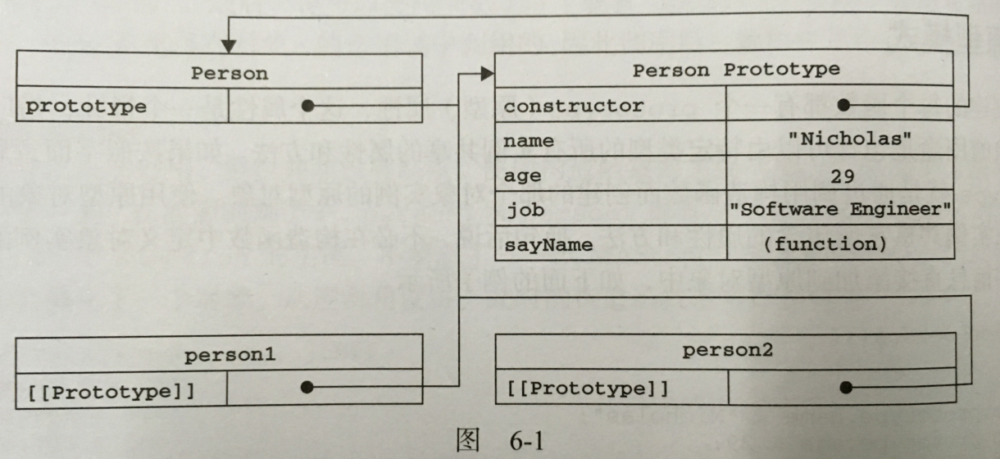

# 原型解释
我们创建的每一个函数都有一个prototype(原型)属性，这个属性是一个指针，指向一个对象（原型对象），原型对象可以让对象实例共享属性和方法，例如：
```
function Person(){}
Person.prototype.name = "lilei";
Person.prototype.age = "18";
Person.prototype.job = "student";
Person.prototype.sayName = function(){
    alert(this.name);
};
var person1 = new Person();
person1.sayName();   //lilei

var person2 = new Person();
person2.sayName();   //lilei

person1.sayName == person2.sayName;   //true
```

# 原型对象
无论何时，只要创建了一个新的函数，那么就会为该函数创建一个prototype属性，这个属性指向函数的原型对象。原型对象有一个constructor属性，这个属性又指向prototype属性所在函数，下图可说明此问题：<br>


