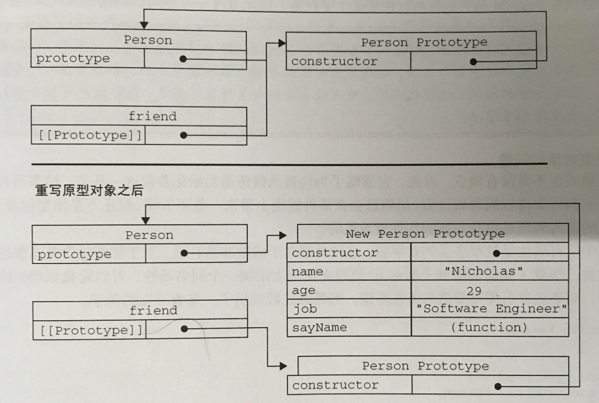

# 重写原型对象
```
function Person(){}
Person.prototype = {
    constructor : Person,
    name : "lelei",
    age : "26",
    job : "coder",
    sayName : function(){
        alert(this.name);
    };
}
```
以上为自定义原型对象定义了constructor属性，并且这个属性指向Person构造函数，因为如果不指定constructor属性，那么这个属性会默认指向Object构造函数。即:<br>
```
var person = new Person();
无论是否指定constructor属性，以下都为true
person instanceof Object  //true
perosn instanceof Person  //true
1.不指定constructor属性
person.constructor == Person   //false
person.constructor == Object   //true
2.指定constructor属性
person.constructor == Person   //true
person.constructor == Object   //false
```

# 原型动态性
eg 1 : <br>
```
var person = new Person();
Person.prototype.sayHi = function(){
    alert("hi");
}
person.sayHi();    //hi  没问题
```
eg 2 : <br>
```
var person = new Person();
Person.prototype = {
    constructor : Person,
    name : "lelei",
    age : "26",
    job : "coder",
    sayHi : function(){
        alert("hi");
    }
}
person.sayHi();    // 报错
```
以上为什么例1没问题，而例2报错，因为例2改变Person函数原型对象，而此时实例person [[Prototype]]属性还是指向的默认的原型对象，默认的原型对象中没有定义sayHi方法，所以会报如下错：
<font color=#DC143C>Uncaught TypeError: person.sayHi is not a function  at demo - 副本.html:18</font>
<br>
下图详细说明原型对象重写前后构造函数Person，原型对象Person.prototype, 实例peron三者之间关系


# 原型对象存在的问题
原型对象可以让由构造方法产生的实例共享属性和方法，但如果共享的属性为引用类型，那么会导致一个实例改变属性值也会影响到其他实例对应属性值。例如：
```
function Person(){}
Person.prototype = {
    constructor : Person,
    name : "lelei",
    age : "26",
    job : "coder",
    friends : ["lintao"],
    sayHi : function(){
        alert("hi");
    }
}
var person1 = new Person();
var person2 = new Person();

person1.friends.push("Van");

alert(person1.friends);    //lintao Van
alert(person2.friends);    //lintao Van

alert(person1.friends  == person2.friends);    //true
```

# 组合使用构造函数模式和原型模式
创建自定义类型的最常见方式，就是组合使用构造函数模式和原型模式。这种模式是ECMAScript中使用最广泛，认同度最高的一种创建自定义类型的方法。构造函数用于定义实例属性，而原型用于定义方法和共享的属性。
```
function Person(name,age,job){
    this.name = name;
    this.age = age;
    this.job = job;
    this.friends = [] ;
}
Person.prototype = {
    constructor : Person,
    sayHi : function(){
        alert("hi");
    }
}
```

# 动态原型模式
```
function Person(name,age,job){
    this.name = name;
    this.age = age;
    this.job = job;
    this.friends = [] ;
    if( typeof this.sayHi != "function"){
        Person.prototype.sayHi = function(){
            alert("hi");
        }
    }
}
```