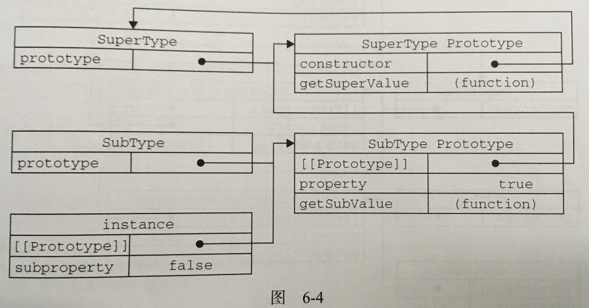
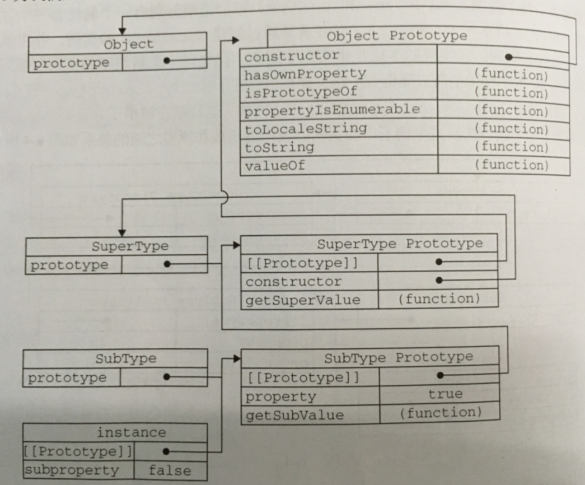
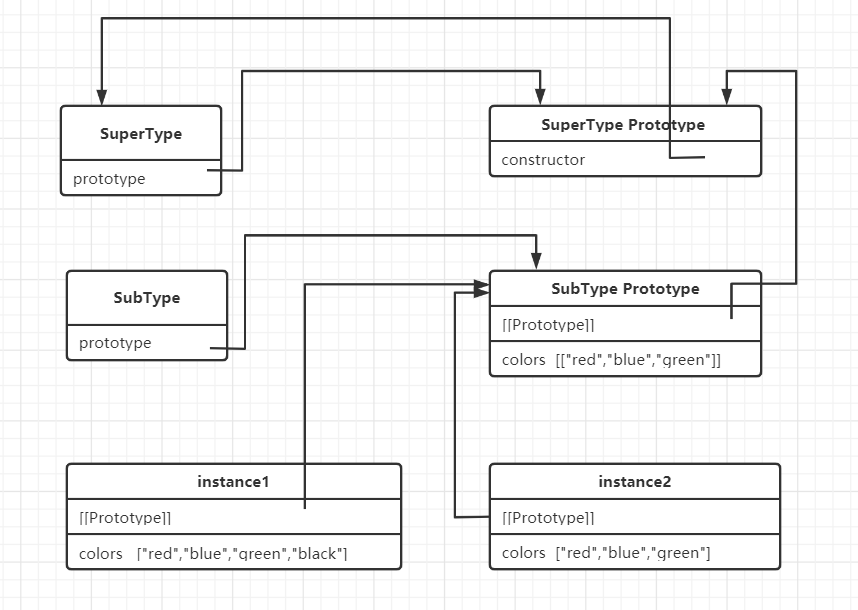

# 原型链
如下：子类SubType的原型对象是父类SuperType的实例，因为父类实例[[Prototype]]属性指向父类的原型，所以子类可以访问父类的属性和方法。
```
function SuperType(){
    this.property = true;
}
SuperType.prototype.getSuperValue = function(){
    return this.property;
};
function SubType(){
    this.subproperty = false;
}
SubType.prototype = new SuperType();
SubType.prototype.getSubValue = function(){
    return this.subproperty;
};
var instance = new SubType();
alert(instance.getSuperValue());    //true;
alert(instance.getSubValue());      //false;
```

## 默认原型
所有引用类型都默认继承了Object，所以我们可以访问toString(),valueOf()这些方法，而这也是通过原型链来实现的，即所有函数的默认原型对象都是Object的实例，即默认函数的原型对象有一个[[Prototype]]属性，它指向Object的原型对象。


## 确定原型和实例的关系
```
instance instanceof Object ;       //true
instance instanceof SuperType ;       //true
instance instanceof SubType ;       //true

Object.prototype.isPrototypeOf(instance);     //true
SuperType.prototype.isPrototypeOf(instance);     //true
SubType.prototype.isPrototypeOf(instance);     //true
```

## 原型链存在的问题
引用类型的原型属性会被所有实例共享，即一个实例改变该属性内容会导致另一个实例访问的内容改变。如下：<br>
```
function SuperType(){
    this.colors = ["red","blue","green"];
}
function SubType(){}
SubType.prototype = new SuperType();
var instance1 = new SubType();
instance1.colors.push("black");

var instance2 = new SubType();
alert(instance2.colors);      //"red","blue","green","black"
```

## 借用构造函数
借用构造函数可以解决原型链中共享引用类型的问题。这种技术的实现比较简单，即在子类构造函数内部调用父类构造函数。如下：<br>
```
function SuperType(){
    this.colors = ["red","blue","green"];
}
function SubType(){
   SuperType.call(this); 
}
//如果不想使用父类原型属性，此行可以去掉
SubType.prototype = new SuperType();
var instance1 = new SubType();
instance1.colors.push("black");
alert(instance1.colors);      //"red","blue","green","black"

var instance2 = new SubType();
alert(instance2.colors);      //"red","blue","green"
```


## 组合继承
上例其实就是组合继承，但是如果去掉SubType.prototype = new SuperType();就仅仅是借用构造函数。
```
function SuperType(name){
    this.name = name;
    this.colors = ["red","blue","green"];
}
SuperType.prototype.sayName = function(){
    alert(this.name);
}
function SubType(name,age){
    //继承属性
   SuperType.call(this,name); 
   this.age = age;
}
//继承方法
SubType.prototype = new SuperType();
SubType.prototype.constructor = SubType;
SubType.prototype.sayAge = function(){
    alert(this.age);
}
var instance1 = new SubType("lilei",25);
instance1.colors.push("black");
alert(instance1.colors);      //"red","blue","green","black"
instance1.sayName();     // "lilei"
instance1.sayAge();      // 25

var instance2 = new SubType("lintao",26);
alert(instance2.colors);      //"red","blue","green"
instance2.sayName();     // "lintao"
instance2.sayAge();      // 26
```