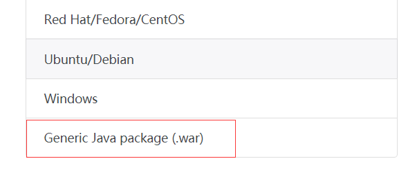
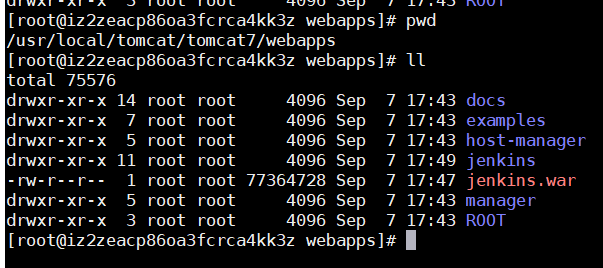
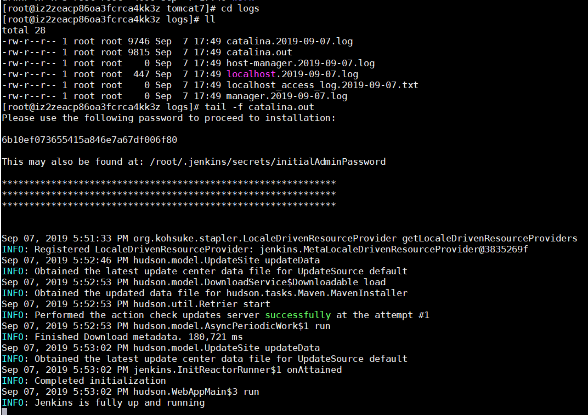
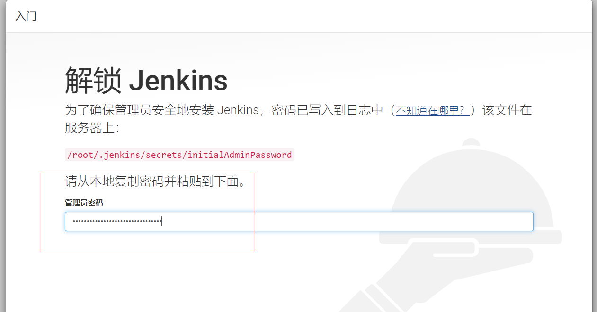
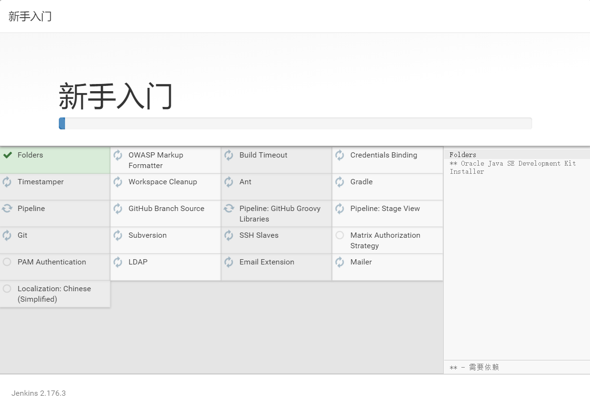
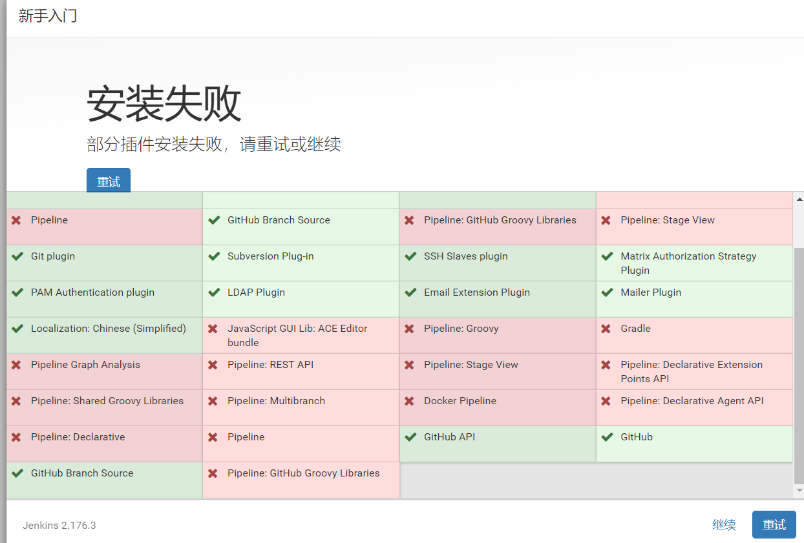
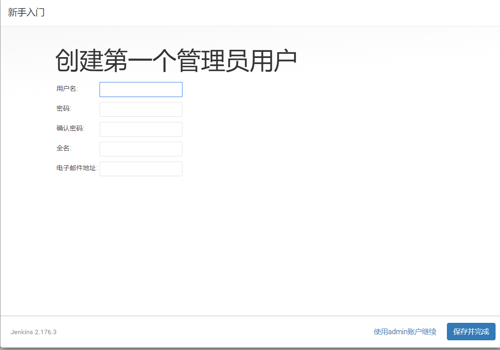
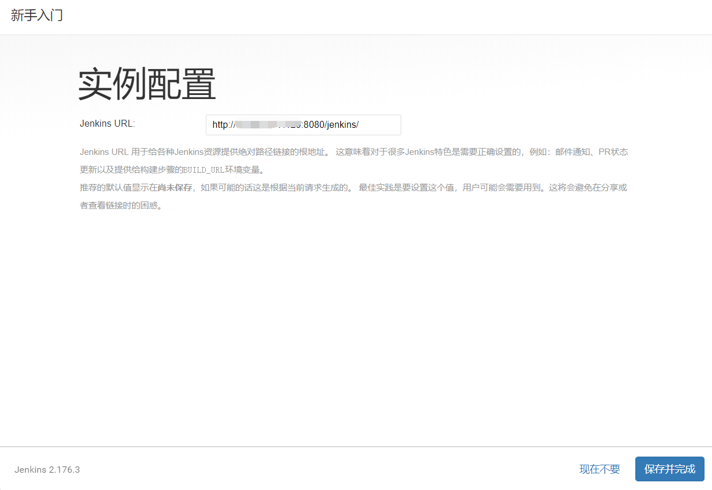

# 1-Jenkins安装（war包部署tomcat方式）
1. **环境准备( CentOS Linux release 7.4.1708 )**
 
- JDK
- 安装git
2. **下载Jenkins war包**
 
[https://jenkins.io/zh/download/](https://jenkins.io/zh/download/)
 

3. **将Jenkins war包放到tomcat webapps目录下**

4. **启动tomcat**
 

5. **访问ip:8080/jenkins/**

按照提示输入密码并继续，选择推荐插件并安装

next 
如果部分插件安装失败可先忽略，之后再解决

next 
新建一个管理员账号

next 
完成安装

