# 2-Jenkins配置（基于github）
### **一.准备**
1. **本地创建git项目并push至github远程仓库**
### **二.相关配置**
1. **配置jdk（全局工具配置）**
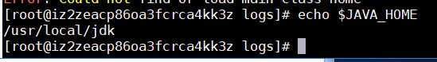
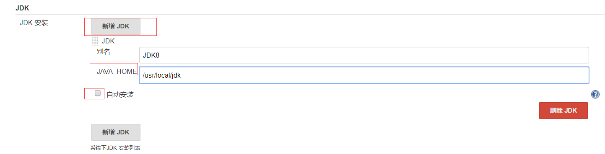
2. **配置Maven**
 
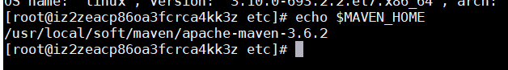
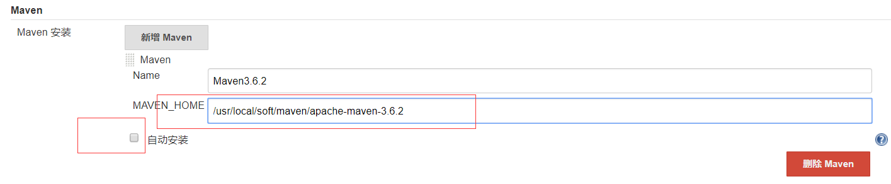
3. **配置git**
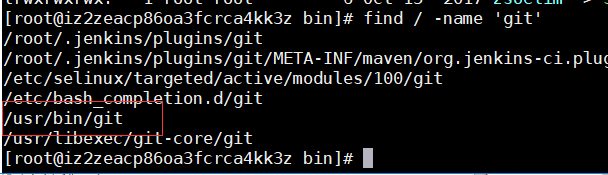
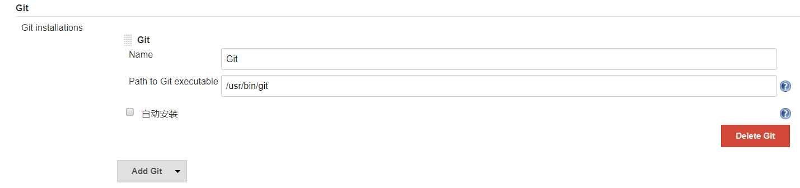
### **三.在Jenkins中创建工程**
1. **新建任务创建一个工程**
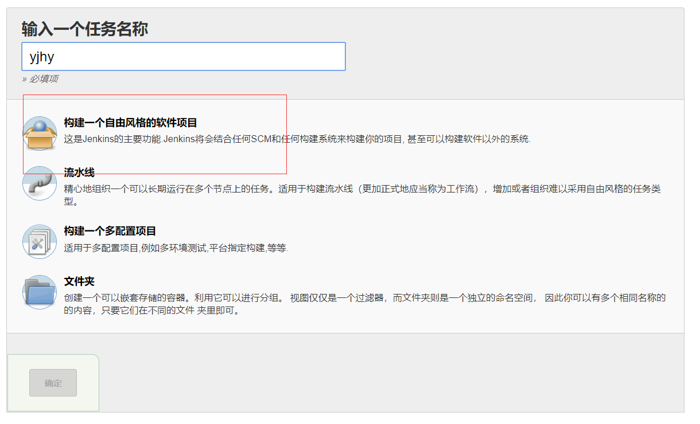
2. **添加github项目地址**
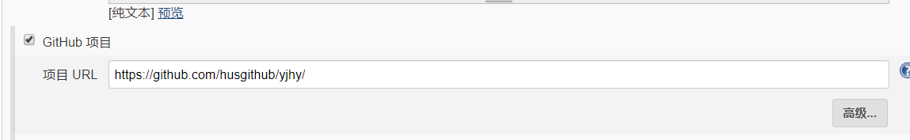
3. **配置源码管理**
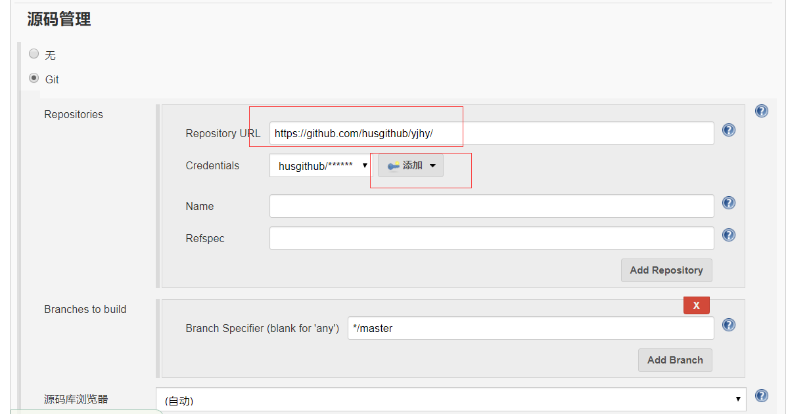
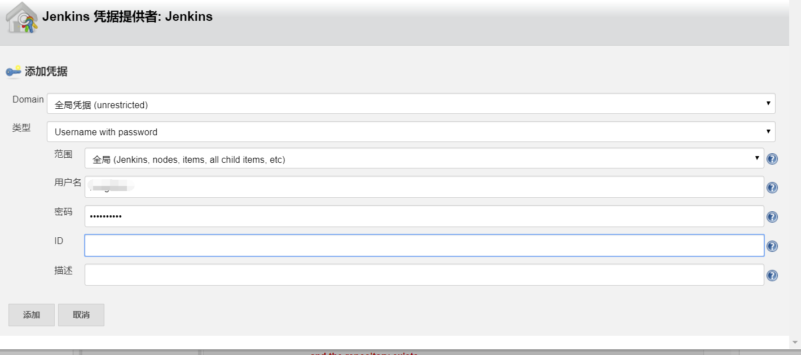
以上要输入github账号和密码
4. **使用maven进行构建**
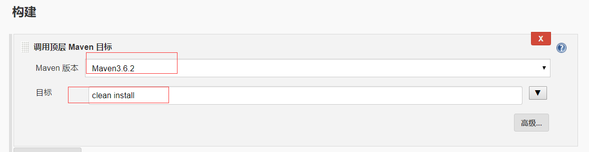
5. **测试**
 
点击立即构建
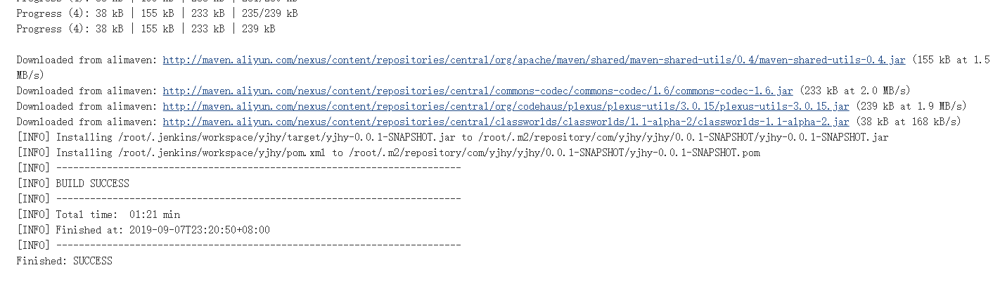

