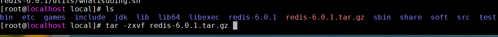
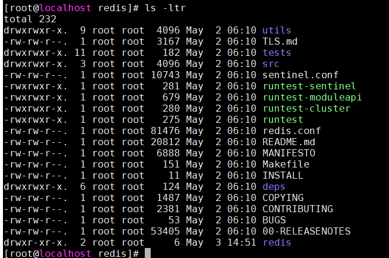
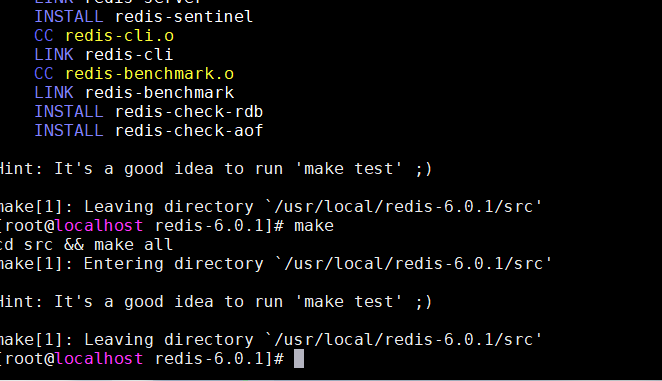
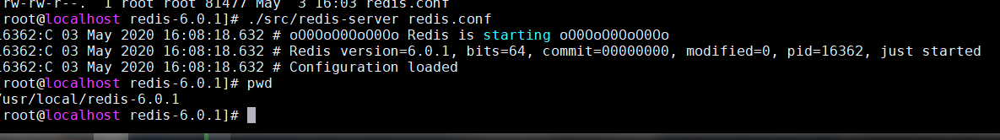
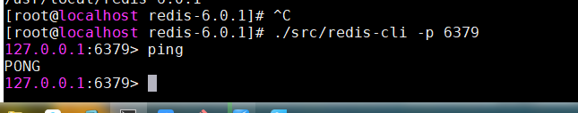
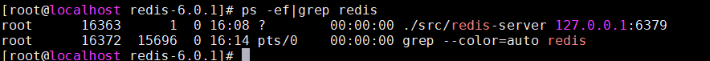
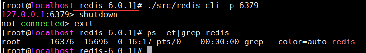

# Redis 官网
  [https://redis.io/](https://redis.io/)   
  [http://www.redis.cn/](http://www.redis.cn/)
# Redis简介
  Redis（Remote Dictionary Server )，即远程字典服务，是一个开源的使用ANSI C语言编写、支持网络、可基于内存亦可持久化的日志型、Key-Value数据库，并提供多种语言的API。

# Redis linux安装
 1. 进入官网下载
       
 2. 解压，如（/usr/local/redis-6.0.1）
         
      
 3. 环境安装  
   **yum install gcc-c++**  
 4. 编译  
    make  
    make install  
      
    
    CentOS Linux release 7.3.1611 安装redis6.0.1报如下错： 
    server.c:3934:43: error: ‘struct redisServer’ has no member named ‘stat_starttime’
     time_t uptime = server.unixtime-server.stat_starttime;
       
     解决方法：  
     >>>
        # 查看gcc版本是否在5.3以上，centos7.6默认安装4.8.5
        gcc -v
        # 升级gcc到5.3及以上,如下：
        升级到gcc 9.3：
        yum -y install centos-release-scl
        yum -y install devtoolset-9-gcc devtoolset-9-gcc-c++ devtoolset-9-binutils
        scl enable devtoolset-9 bash
        需要注意的是scl命令启用只是临时的，退出shell或重启就会恢复原系统gcc版本。
        如果要长期使用gcc 9.3的话：

        echo "source /opt/rh/devtoolset-9/enable" >>/etc/profile
        这样退出shell重新打开就是新版的gcc了
        以下其他版本同理，修改devtoolset版本号即可。
        原文链接：https://blog.csdn.net/zhengwei424/article/details/105901955/
     >>>
5. 修改 redis.conf 配置文件（可先备份）  
   daemonize no  （后台运行改成yes） 
6. 启动Redis 服务
      
7. 测试
       
     
8. 关闭Redis服务
   