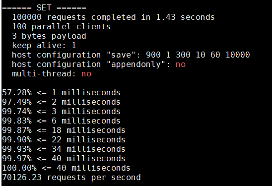

# redis-benchmark 介绍
Redis 自带了一个叫 redis-benchmark 的工具来模拟 N 个客户端同时发出 M 个请求。 （类似于 Apache ab 程序）。你可以使用 redis-benchmark -h 来查看基准参数。
[http://www.redis.cn/topics/benchmarks.html](http://www.redis.cn/topics/benchmarks.html)

```
以下参数被支持：

Usage: redis-benchmark [-h <host>] [-p <port>] [-c <clients>] [-n <requests]> [-k <boolean>]

 -h <hostname>      Server hostname (default 127.0.0.1)
 -p <port>          Server port (default 6379)
 -s <socket>        Server socket (overrides host and port)
 -a <password>      Password for Redis Auth
 -c <clients>       Number of parallel connections (default 50)
 -n <requests>      Total number of requests (default 100000)
 -d <size>          Data size of SET/GET value in bytes (default 2)
 -dbnum <db>        SELECT the specified db number (default 0)
 -k <boolean>       1=keep alive 0=reconnect (default 1)
 -r <keyspacelen>   Use random keys for SET/GET/INCR, random values for SADD
  Using this option the benchmark will expand the string __rand_int__
  inside an argument with a 12 digits number in the specified range
  from 0 to keyspacelen-1. The substitution changes every time a command
  is executed. Default tests use this to hit random keys in the
  specified range.
 -P <numreq>        Pipeline <numreq> requests. Default 1 (no pipeline).
 -q                 Quiet. Just show query/sec values
 --csv              Output in CSV format
 -l                 Loop. Run the tests forever
 -t <tests>         Only run the comma separated list of tests. The test
                    names are the same as the ones produced as output.
 -I                 Idle mode. Just open N idle connections and wait.
```
以下为本机100个客户端100000并发的测试命令：<br>
redis-benchmark -h 127.0.0.1 -p 6379 -c 100 -n 100000    <br>
