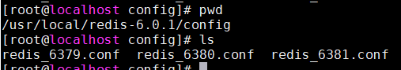

# 什么是Redis主从复制
主从复制，是指将一台Redis服务器的数据，复制到其他的Redis服务器。前者称为主节点(master)，后者称为从节点(slave)；数据的复制是单向的，只能由主节点到从节点。

默认情况下，每台Redis服务器都是主节点；且一个主节点可以有多个从节点(或没有从节点)，但一个从节点只能有一个主节点。

# 主从复制的作用
1. 数据冗余：主从复制实现了数据的热备份，是持久化之外的一种数据冗余方式。
2. 故障恢复：当主节点出现问题时，可以由从节点提供服务，实现快速的故障恢复；实际上是一种服务的冗余。
3. 负载均衡：在主从复制的基础上，配合读写分离，可以由主节点提供写服务，由从节点提供读服务（即写Redis数据时应用连接主节点，读Redis数据时应用连接从节点），分担服务器负载；尤其是在写少读多的场景下，通过多个从节点分担读负载，可以大大提高Redis服务器的并发量。
4. 高可用基石：除了上述作用以外，主从复制还是哨兵和集群能够实施的基础，因此说主从复制是Redis高可用的基础。

# 如何实现
不配置从节点的情况下，Redis默认为主节点，可通过 info replication 命令查看，其中role为master
 ```
 [root@localhost redis-6.0.1]# ./src/redis-server ./config/redis_6379.conf
[root@localhost redis-6.0.1]# ps -ef|grep redis
root       2466      1  0 00:33 ?        00:00:00 ./src/redis-server 127.0.0.1:6379
root       2472   2228  0 00:33 pts/0    00:00:00 grep --color=auto redis
[root@localhost redis-6.0.1]# ./src/redis-cli -p 6379
127.0.0.1:6379> info replication
# Replication
role:master
connected_slaves:0
master_replid:6631e25adb3323eca12f3418112fce263179592e
master_replid2:0000000000000000000000000000000000000000
master_repl_offset:0
master_repl_meaningful_offset:0
second_repl_offset:-1
repl_backlog_active:0
repl_backlog_size:1048576
repl_backlog_first_byte_offset:0
repl_backlog_histlen:0

 ```
以一主二从为例，由于本机测试，所以需要如下准备: <br>
1. 新建/usr/local/redis-6.0.1/config 文件夹，将
/usr/local/redis-6.0.1/redis.conf文件复制三份到此文件夹

2. 分别修改对应配置文件中如下配置
   ```
   port 6379
   pidfile /var/run/redis_6379.pid
   logfile "logfile-6379"    #日志文件名
   dbfilename dump-6379.rdb  #持久化文件名
   ```
3. 配置主从关系（假设6379为主，6380,6381为从） <br>
  ```
   1）配置redis_6380.conf，redis_6381.conf #### REPLICATION ###部分，将 replicaof <masterip> <masterport> 改成 replicaof 127.0.0.1 6379
   2) 分别启动三个节点
    [root@localhost redis-6.0.1]# ./src/redis-server ./config/redis_6379.conf
    [root@localhost redis-6.0.1]# ./src/redis-server ./config/redis_6380.conf
    [root@localhost redis-6.0.1]# ./src/redis-server ./config/redis_6381.conf
    [root@localhost redis-6.0.1]# ps -ef|grep redis
    root       2581      1  0 00:50 ?        00:00:00 ./src/redis-server 127.0.0.1:6379
    root       2587      1  0 00:50 ?        00:00:00 ./src/redis-server 127.0.0.1:6380
    root       2594      1  0 00:51 ?        00:00:00 ./src/redis-server 127.0.0.1:6381
    root       2601   2507  0 00:51 pts/0    00:00:00 grep --color=auto redis
   3) 使用info replication命令查看各个节点具体信息 
    [root@localhost redis-6.0.1]# ./src/redis-cli -p 6381
    127.0.0.1:6381> info replication
    # Replication
    role:slave
    master_host:127.0.0.1
    master_port:6379
    master_link_status:up
    master_last_io_seconds_ago:1
    master_sync_in_progress:0
    slave_repl_offset:238
    slave_priority:100
    slave_read_only:1
    connected_slaves:0
    master_replid:4b231b908e76e9e35ad128ee35aca057c4504175
    master_replid2:0000000000000000000000000000000000000000
    master_repl_offset:238
    master_repl_meaningful_offset:14
    second_repl_offset:-1
    repl_backlog_active:1
    repl_backlog_size:1048576
    repl_backlog_first_byte_offset:15
    repl_backlog_histlen:224

  ```
以上主从复制配置完成，可通过在不同节点设置值进行测试：
1. 在主节点中set key 在从节点中get key可拿到值  
2. 在从节点中set key 报如下错误，即只可读：
    ````
    127.0.0.1:6381> set name 6381
    (error) READONLY You can't write against a read only replica.
    ````
<br>
参考：[https://www.cnblogs.com/kismetv/p/9236731.html](https://www.cnblogs.com/kismetv/p/9236731.html)