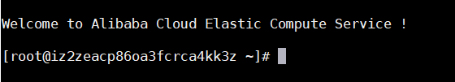
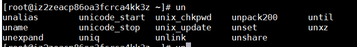
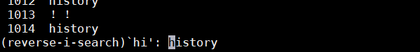
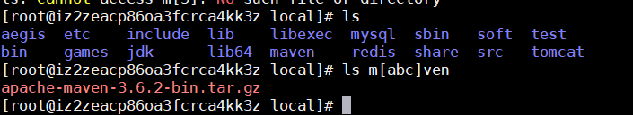
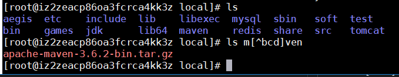
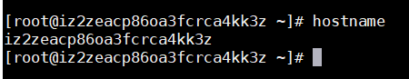

## 命令行BASH的基本操作
### 1. 命令行终端界面

如上所示：
 
root : 当前登录的用户  
@: 分割符  
@后的一串：主机名  
~ ：表示当前所在目录  
&#35;（提示符） ：表示当前用户为超级管理员  
&#36; （提示符）：表示当前用户为普通用户  
### 2. 命令组成部分
- 命令
- 选项
- 参数
### 3.使用技巧
1.按一下tab键命令自动补全，按两下tab键可显示所有相关命令

### 4. 查看历史记录
1.键盘上下键
 
按住键盘上/下键即可查看上几次输入的命令 
如果想要查看所有曾经输入的命令可以使用 history 命令 
2.其他查看历史记录的方式
 
!! : 重复执行上一次的命令 
!字符 ：重复执行上一次以指定字符开始的命令 
!num : 按照历史记录的序号执行命令 
!?abc ：重复执行包含abc的命令 
3.模糊查找之前输入的某个命令
 
按住 Ctrl + r 进入命令搜索模式，输入匹配字符串,回车即可执行找到的命令

### 5. 命令行通配符
- &#42; 匹配0个或多个
- ? 匹配任意一个字符
- [abc] 匹配列表里的任何字符串

- [^abc] 匹配列表以外的任何字符串

### 5. 常用命令
hostname : 查看当前主机名

