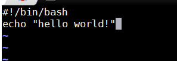
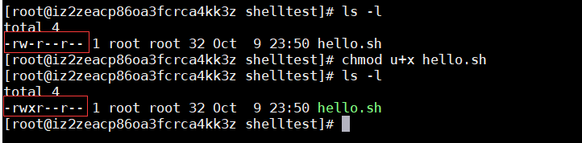
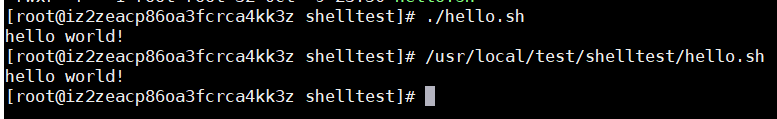

### Shell入门
Shell是系统的用户界面，提供了用户与内核进行交互操作的一种接口。它接收用户输入的命令并把它送入内核去执行。
### Shell脚本
Shell 脚本（shell script），是一种为 shell 编写的脚本程序。

### Shell 环境
Shell 编程跟 JavaScript、php 编程一样，只要有一个能编写代码的文本编辑器和一个能解释执行的脚本解释器就可以了。

Linux 的 Shell 种类众多，常见的有： 

Bourne Shell（/usr/bin/sh或/bin/sh） 
Bourne Again Shell（/bin/bash） 
C Shell（/usr/bin/csh） 
K Shell（/usr/bin/ksh） 
Shell for Root（/sbin/sh） 
…… 
本文介绍的 Bash，也就是 Bourne Again Shell，由于易用和免费，Bash 在日常工作中被广泛使用。同时，Bash 也是大多数Linux 系统默认的 Shell。

在一般情况下，人们并不区分 Bourne Shell 和 Bourne Again Shell，所以，像 #!/bin/sh，它同样也可以改为 #!/bin/bash。

>#!/bin/bash 意思是告诉执行器需要调用/bin/bash来执行此脚本
#### 编写第一个Shell脚本
1.  vi hello.sh （创建一个脚本）
2. 第一行加入 #!/bin/bash
3. 编写内容并保存
    
4. 给当前用户赋予shell脚本可执行权限
  
5. 执行shell脚本（可用相对路径，也可用绝对路径）
  
