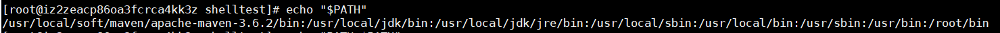
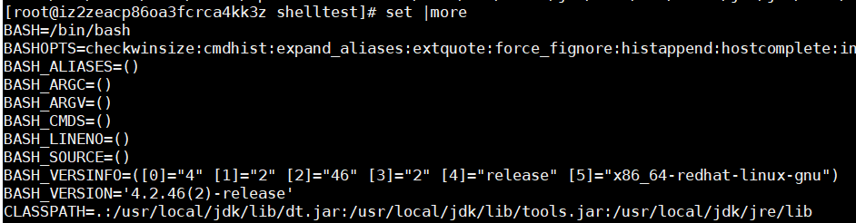
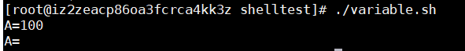
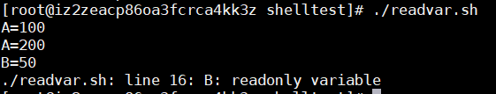
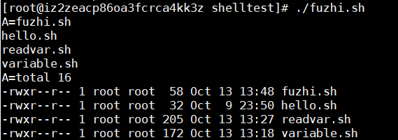
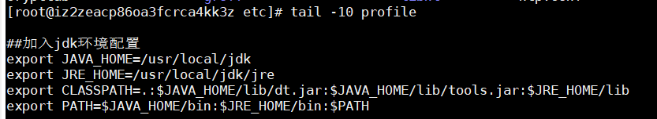
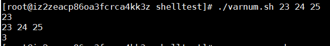

## Shell变量
Shell中变量分为两种：系统变量和用户自定义变量
- 系统变量：$HOME,$PATH,$PWD,$SHELL,$USER 等
- 输出系统变量：<br>
  echo "$PATH"   <br>
   <br>
- 显示当前所有系统变量 <br>
  set | more <br>
   <br>

  
### 自定义变量


- 变量定义与撤销
  ```
  #!/bin/bash
  #定义变量A(变量名与=号之间不能有空格)
  A=100
  #使用变量A（也可以用${A}）
  echo "A=$A"
  #删除变量A
  unset A
  #再次输出
  echo "A=${A}"
  ```
  运行结果：<br>
  <br>
- 只读变量 (在变量前加readonly)
  ```
  #!/bin/bash
  #定义非只读变量A
  A=100
  #输出变量A
  echo "A=${A}"
  #对A重新赋值
  A=200
  #重新输出
  echo "A=${A}"

  #定义只读变量B
  readonly B=50
  #输出B
  echo "B=${B}"
  #对B重新赋值
  B=20
  ```
  <br>
  以上说明只读变量不能再次赋值，此外只读变量不能unset <br>
- 变量定义规则<br>
  1. 变量名称可以有数字，字符，下划线组成,但不能以数字开头。
  2. 等号两次不能有空格
  3. 变量名称一般习惯大写

- 将命令的返回值赋值给变量<br>
  ```
  #!/bin/bash
  A=`ls`
  echo "A=${A}"
  A=$(ls -l)
  echo "A=${A}"
  #以上 `ls` 与 $(ls) 的方式都可以使用
  ```
   <br>

### 设置环境变量 （以JAVA_HOME为例）

1. 在 /etc/profile 中定义（将Shell变量输出为环境变量） <br>
   export JAVA_HOME=/usr/local/jdk <br>
2. 执行 source /etc/profile  使环境变量立即生效 <br>
3. echo "$JAVA_HOME"  查看环境变量值<br>



### 位置参数变量
#### 介绍
执行Shell脚本时，如果需要接收命令行参数信息,可以使用位置参数变量。
#### 基本语法
- $n (n为数字,$0 表示命令行本身,$1-$9表示第1~9个参数,10以上的参数则使用${n} )
- $* (表示命令行中的所有参数)
- $@ (也是表示命令行的所有参数，但$@对每个参数区分对待)
- $# (表示命令行的参数个数)
<br>案例：<br>
  ```
  #!/bin/bash
  #输出第1个参数
  echo "$1"
  #输出所有参数
  echo "$*"
  #参数个数
  echo "$#"
  ```
  

 
