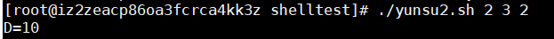
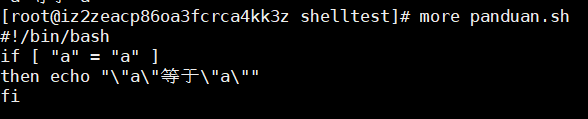

## Shell语法
## 运算符
#### 基本语法：
- $(( m+n ))
- $[ m+n ]
- expr m + n (expr 与运算符之间要有空格)
- 加减乘除取余分别用以下方式表示
  ```
  + - * / %
  ```

#### 使用三种方式运算 (A+B)*C ：
  ```
  #!/bin/bash
  A=10
  B=3
  C=2
  #使用 $(())方式
  D="$(((${A} + ${B})*${C} ))"
  #使用$[]方式
  E="$[(${A} + ${B})*${C}  ]"
  #使用expr方式
  TEMP=`expr ${A} + ${B}`
  echo "TEMP=${TEMP}"
  F=`expr ${TEMP} \* ${C}`
  echo "D=${D},E=${E},F=${F}"
  ```
  <br>以上建议使用第二种方式<br>
#### 命令行输入A，B , C三个参数并运算
```
#!/bin/bash
D=$[ ($1 + $2)*$3 ]
echo "D=${D}"
```



## 条件语句
[ condition ] (条件前后要有空格)
#### 常用的判断条件
- = 比较字符串是否相等 
  
- -lt  (小于less than)  
- -le  (小于等于less than or equal to)
- -eq  (等于 equal)
- -gt  (大于 greater than)
- -ge  (大于等于 greater than or equal to)
- -ne  (不等于 not equal to)
#### 文件相关判断
- -r 有读的权限
- -w 有写的权限
- -x 有可执行权限
- -f 文件存在并且是一个常规文件
- -e 文件存在
- -d 文件存在并且是一个目录