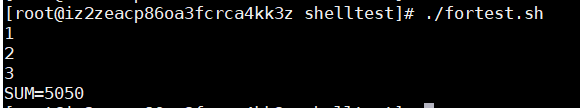
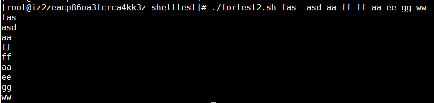
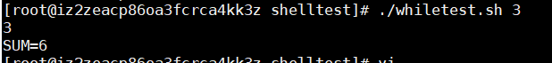

## Shell语法
## 运算符
#### 基本语法：
- $(( m+n ))
- $[ m+n ]
- expr m + n (expr 与运算符之间要有空格)
- 加减乘除取余分别用以下方式表示
  ```
  + - * / %
  ```

#### 使用三种方式运算 (A+B)*C ：
  ```
  #!/bin/bash
  A=10
  B=3
  C=2
  #使用 $(())方式
  D="$(((${A} + ${B})*${C} ))"
  #使用$[]方式
  E="$[(${A} + ${B})*${C}  ]"
  #使用expr方式
  TEMP=`expr ${A} + ${B}`
  echo "TEMP=${TEMP}"
  F=`expr ${TEMP} \* ${C}`
  echo "D=${D},E=${E},F=${F}"
  ```
  <br>以上建议使用第二种方式<br>
#### 命令行输入A，B , C三个参数并运算
```
#!/bin/bash
D=$[ ($1 + $2)*$3 ]
echo "D=${D}"
```


## 条件语句
[ condition ] (条件前后要有空格)
#### 常用的判断条件
- = 比较字符串是否相等 
  <br> <br>
- -lt  (小于less than)  
- -le  (小于等于less than or equal to)
- -eq  (等于 equal)
- -gt  (大于 greater than)
- -ge  (大于等于 greater than or equal to)
- -ne  (不等于 not equal to)
#### 文件相关判断
- -r 有读的权限
- -w 有写的权限
- -x 有可执行权限
- -f 文件存在并且是一个常规文件
- -e 文件存在
- -d 文件存在并且是一个目录
```
#!/bin/bash
if [ "a" = "a" ]
then echo "\"a\"等于\"a\""
fi

if [ 2 -lt 3 ]
then echo "2小于3"
fi

if [ 2 -ne 3 ]
then echo "2 不等于3"
fi

#判断文件是否有可读权限
if [ -r /usr/local/test/shelltest/abc.txt ]
then echo "有abc.txt文件可读权限"
fi

#判断文件是否存在
if [ -e /usr/local/test/shelltest/abc.txt  ]
then echo "存在/usr/local/test/shelltest/abc.txt文件"
fi
```

## 流程控制
#### 以下为if流程控制语句的三种写法
```
#!/bin/bash

#if
if [ 3 -gt 2 ]
then
echo "3>2"
fi

#else if (if与then在同一行时then前必须加分号)
if [ 3 -gt 4 ] ; then
echo "3>4"
elif [ 3 -gt 2 ]; then
echo "3>2"
fi

#if else
if [ 3 -ge 4 ]
then echo "3>=4"
else echo "3<4"
fi
```
#### case 流程控制语句
判读用户输入数字并转换成一周的第几天<br>
```
#!/bin/bash
case $1 in
"6")
echo "周六"
;;
"7")
echo "周日"
;;
*)
echo "其他"
;;
esac
```
#### for循环
```
#!/bin/bash

#语法1
for A in 1 2 3
do
  echo "${A}"
done

#语法2
SUM=0
for(( i=1;i<=100;i++  ))
do
  SUM=$[ ${SUM}+$i ]
done
echo "SUM=${SUM}"

```

其他例子：<br>
输出命令行参数（未知个数）<br>
```
#!/bin/bash
for i in $@
do
echo "$i"
done
```

#### while循环
输入一个数n，计算1 ~ n 的和<br>
```
#!/bin/bash
echo "$1"
I=1
SUM=0
while [ ${I} -le  $1 ]
do
SUM=$[ ${SUM}+${I} ]
I=$[ ${I}+1 ]
done
echo "SUM=${SUM}"
```
