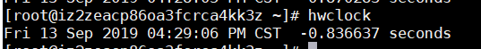
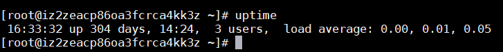
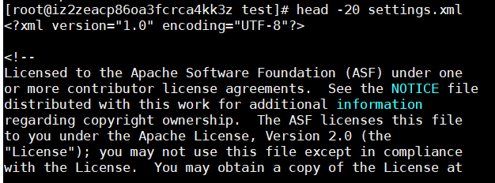
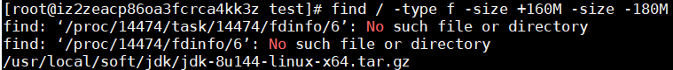

### linux系统常用命令
#### 日期时间
- **date** (查看/设置系统时间) 
 
- **hwclock/clock** (显示硬件时钟时间) 
 
- **cal** (查看日历)  

- **uptime** (查看系统运行时间) 

#### 输出查看命令
- **echo** (显示输入的内容) 

- **cat** (显示文件内容) 

- **head** (显示文件的头几行，默认为10) 

- **tail** (显示文件末尾几行,默认10) 
-n 指定显示行数 
-f (follow) 追踪显示文件(可用于查看日志)  
- **more** (翻页显示文件内容,只可向下翻页) 
- **less** (可上下翻页文件内容) 
#### 关机重启
- **shutdown** (关闭/重启计算机) 
-h 关闭计算机 
-r 重启 

- **poweroff** (立即关闭计算机) 
- **reboot** (立即重启) 

#### 归档，压缩
- **zip** （压缩文件，需安装压缩解压工具） 
 
- **upzip** （解压文件，需安装压缩解压工具） 

- **tar** (使用tar命令进行文件归档) 
**tar -cvf** （添加一个归档） 
 
**tar -xvf** （释放一个归档） 
 
**tar -zcvf** （添加一个归档并使用gzip压缩） 
 
**tar -zxvf** （解压缩并释放归档） 
 
#### 查找
> **find / -name " &#42;ab&#42; "** （查找 / 目录下名字包含字符串ab的文件） 
>**find / -name "*.txt"**（查找 / 目录下所有txt文件） 
>**find / -type d** （查找 / 目录下所有文件夹） 
>**find /usr/local/ -user test** （查找 /usr/local/ 目录下用户为 test 的文件） 
 
>**find / -size +100M** （查找 / 目录下大小大于100M的文件） 

>**find / -type f -size +160M -size -180M** （查找 / 目录下大小大于160M并且小于180M的文件） 
 
