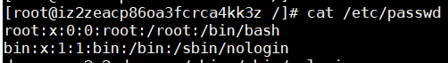
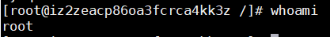
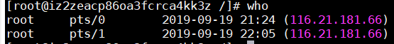
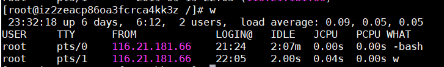
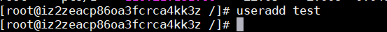
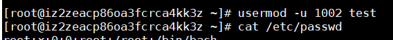

### linux用户基础
#### 用户
- 用户可以分为三种：
1. root 用户（ID为0的用户）
2. 系统用户 （ID在1~499）
3. 普通用户 （ID在500以上）
- 系统中的文件都有一个所属用户及所属组
- 使用id命令可以查看当前用户信息
- 使用passwd命令可以修改当前用户密码
#### 相关文件
- /etc/passwd 保存用户信息

每一行代表一个用户信息，如： 
root:x:0:0:root:/root:/bin/bash  
root : 用户名  
x : 用户密码 
0 : UserId  
0 : GroupId  
root : 用户描述信息  
/root : 用户家目录  
/bin/bash : 用户登陆shell  

- /etc/shadow 保存用户密码（已加密）
- /etc/group 保存组信息

#### 查看当前登录的用户
- whoami (显示当前用户名)

- who (显示已经登录系统的用户)

- w (显示登录系统的用户详细信息)

#### 创建用户
- **useradd** (创建用户) 
 
用户信息如下： 
test:x:1001:1001::/home/test:/bin/bash  

#### 修改用户
- **usermod** (修改用户) 
格式：usermod -option username
- -l 修改用户名
- -u 修改用户id
 
- -d 修改用户家目录
- -g 修改用户所属主组
- -G 修改用户所属附属组
- -L 锁定用户
- -U 解除锁定

#### 删除用户
- userdel test (保留用户家目录)
- userdel -r test (不保留用户家目录)

#### 组

#### 创建组
- groupadd test

#### 修改组信息
- groupmod -n newname oldname (修改组名)
- groupmod -g newGid groupName (修改组id)
example: groupmod -g 1003 test2  

#### 删除组
- groupdel test

