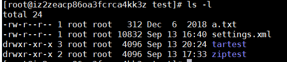

### linux权限机制
#### 文件权限
linux中，每个文件拥有三种
权限	|对文件的影响|对目录的影响
:--|:--|:--
r（读取）|可读取文件内容|可列出目录内容
w（写入）|可修改文件内容|可在目录中创建删除文件
x（执行）|可作为命令执行|可访问目录内容
#### UGO
linux权限基于UGO模型进行控制： 
- U（User）,G（Group），O（Other）
- 每一个文件的权限基于UGO进行设置
- 权限三个为一组(rwx)，对应UGO分别设置
- 每一个文件拥有一个所属用户和所属组，对应UG，不属于该文件所属用户或所属组的使用O权限（既不是文件拥有用户，也不在文件拥有用户所属组中的用户的权限）
- 使用 ls -l 命令查看文件信息

 
例如：drwxr-xr-x 3 root root  4096 Sep 13 20:24 tartest  
drwxr-xr-x ： UGO信息（第一个字母表示文件类型，-为普通文件，d为目录） 
3 : 链接数量  
root ： 所属用户 
root ： 所属组 
4096 : 文件大小 
Sep 13 20:24 : 文件更改时间 
tartest : 文件名 

#### 修改文件所属用户与组
- chown (change file owner and group
)  
例如: 可以将tartest文件夹所属用户改成test  

chown -R test tartest/ (-R递归) 

- chgrp (change group ownership) 
同理：将tartest文件夹所属组改成test 
chgrp -R test tartest/  

#### 修改文件权限
先看个例子： 
当前登录用户为test2 tartest文件夹所属用户为test，test2拥有权限为r--，即只可读 
  
修改文件a.txt内容保存提示如下： 

- chmod (change file mode bits)
格式如下： 
chmod 模式 文件  
- 模式为如下格式： 
u , g , o 分别表示用户，组和其它 
a 可以表示ugo全部  
+,- 分别表示加入或者删除权限 
r ,w ,x 代表三种权限 
- 实例： 
切换至root用户 
  
使用 **chmod o+wx a.txt**命令修改文件权限，这样test2便可以修改这个文件了 
 
- 递归修改文件夹权限 
chmod -R o+wx tartest

#### 使用数字的方式修改文件权限
- r,w,x权限用数字表示分别为： 
-r = 4 (2^2) 
-w = 2 (2^1)  
-x = 1 (2^0)  
- 使用数字表示权限时，每组权限分别为对应数字之和： 
rw = 4+2 = 6  
rwx = 4+2+1 = 7  
r-x = 4+1 = 5  
- 数字表示ugo权限使用方式如下： 
**chmod -R 775 tartest/**  
