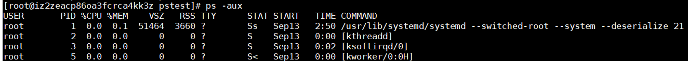
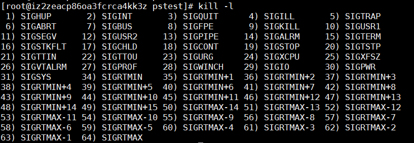

### linux进程

#### 查看进程
**ps (report a snapshot of the current processes.)** 
- ps -a : 显示当前终端所有进程信息
- ps -u : 以用户的格式显示进程信息
- ps -x : 显示后台进程运行的参数
- ps -ef : 以全格式显示当前所有进程

    属性| 解释 |
    :--|:--
    USER| 用户名
    PID | 进程ID号
    %CPU | 该进程使用掉的CPU资源百分比
    %MEM | 该进程所占用的物理内存百分比
    VSZ | 该进程使用掉的虚拟内存量 (Kbytes)
    RSS | 该进程占用的固定的内存量 (Kbytes)
    STAT |该程序目前的状态，主要的状态有：
    &nbsp; |R 运行 ; S 睡眠 ; I 空闲 ;  Z 僵死 ; D 不可中断 ;
    &nbsp; |T 终止 ; P 等待交换页 ; W 无驻留页 ; X 死掉的进程;
    &nbsp; |< 高优先级进程 ; N 低优先级进程 ;  L 内存锁页 ;
    &nbsp; |s 进程的领导者（在它之下有子进程）;  l 多进程的 ; + 位于后台的进程组
    START | 进程启动时间和日期
    TIME  | 进程使用的总cpu时间
    COMMAND | 正在执行的命令行命令

#### 终止进程
**kill (terminate a process)**    
- kill -l : 输出全部信号名称
    
- kill -9 pid : 强制终止某个进程  