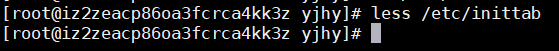

### linux服务
服务（service）本质就是进程，但是是运行在后台的，通常都会监听某个端口，等待其他程序的请求，比如（mysql，firewalld防火墙等）。
#### service命令
- service --help : 显示当前终端所有进程信息
    
- service firewalld status 查看防火墙状态
    
- service firewalld stop 关闭防火墙
    
- service firewalld start 启动防火墙
    
- service firewalld restart 重启防火墙  
- 注意：
  >①关闭或重启服务后，立即生效（windows可以使用 telnet ip port 测试） 
  >②这种方式只是临时生效，当系统重启后，还是会以默认设置为准 
  >③如果希望某个服务自启动或关闭永久生效，要是用chkconfig命令 

#### 查看服务名称
- ls -l /etc/init.d/
   
#### 查看服务运行级别  
 
- less /etc/inittab 
   

#### chkconfig 命令
chkconfig 命令可以给各个运行级别设置自启动/关闭  
- chkconfig --add name (添加服务)
- chkconfig --del name (删除服务)
- chkconfig --list|grep "服务名"  (查看服务)
- chkconfig 服务名 --list
- chkconfig --level 5 服务名 on/off
#### Centos7下chkconfig设置MySql自动启动
1. 将服务文件拷贝到init.d下，并重命名为mysql （如果已经有则忽略） 
cp /usr/local/mysql/support-files/mysql.server /etc/init.d/mysql  
2. 赋予可执行权限  
chmod +x /etc/init.d/mysql  
3. 添加服务  
chkconfig --add mysql  
4. 查看是否添加成功 chkconfig --list 
 如果看到mysql的服务如下图所示2,3,4,5都是开的话则成功 
  
5. 设置各运行级别自启动 chkconfig --level 2345 mysql on  
6. reboot 重启测试 
 

