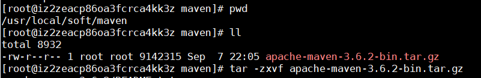

# Maven安装
1. **下载maven压缩包**
<br>
[https://maven.apache.org/download.cgi](https://maven.apache.org/download.cgi)
2. **解压Maven包**
<br>

3. **配置setting.xml（可以先备份下）**
```
    <!--添加阿里云镜像 -->
    <mirror>
        <id>alimaven</id>
        <mirrorOf>central</mirrorOf>
        <name>aliyun maven</name>
        <url>http://maven.aliyun.com/nexus/content/repositories/central/</url>
    </mirror>

```
4. **添加环境变量**
<br>
编辑/etc/profile文件，在文件末尾添加以下配置
```
##加入Maven环境变量
export MAVEN_HOME=/usr/local/soft/maven/apache-maven-3.6.2
export PATH=$MAVEN_HOME/bin:$PATH
```

5. **运行source /etc/profile，刷新环境变量**

5. **测试**
